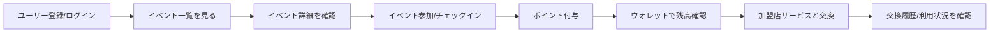
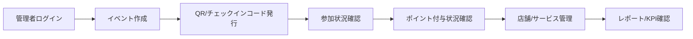

# Link Town ビジネス設計書テンプレート

> 本テンプレートは、Link Town の事業設計を整理するための記入用ドキュメントです。
> `TODO:` を埋める形で、企画、事業性、運用、収益性、リスク、KPI を一通り確認できます。

## 1. ドキュメント基本情報

| 項目 | 内容 |
| --- | --- |
| ドキュメント名 | Link Town ビジネス設計書 |
| 作成日 | TODO: YYYY-MM-DD |
| 作成者 | TODO: 氏名/チーム名 |
| 対象バージョン | TODO: 例 v0.1 / MVP / 実証実験版 |
| 対象地域 | TODO: 市区町村、商店街、自治体、大学など |
| 想定読者 | TODO: 経営者、自治体担当者、開発者、営業担当、協力店舗など |
| 関連資料 | TODO: BASE_SPEC.md、UI資料、API仕様、提案資料など |

## 2. エグゼクティブサマリー

### 2.1 事業概要

TODO: Link Town が誰のどんな課題を解決し、どのような価値を提供する事業かを3から5行で記述する。

例:
- 地域イベントへの参加を促進し、参加者にポイントを付与する。
- 付与されたポイントを地域店舗やサービスで利用できるようにする。
- 自治体、地域団体、店舗、住民をつなぎ、地域内の回遊と消費を増やす。

### 2.2 事業の目的

- TODO: 地域参加率の向上
- TODO: 地域店舗への送客
- TODO: 住民接点データの蓄積
- TODO: 行政/地域団体の施策効果測定

### 2.3 成功条件

| 成功条件 | 判定指標 | 目標値 | 期限 |
| --- | --- | --- | --- |
| TODO: 例 イベント参加増加 | 月間参加回数 | TODO | TODO |
| TODO: 例 加盟店利用増加 | ポイント交換件数 | TODO | TODO |
| TODO: 例 継続利用 | 月間アクティブユーザー | TODO | TODO |

## 3. 背景と課題

### 3.1 市場/地域背景

TODO: 対象地域の人口構成、商圏、地域イベント、商店街、自治体施策などを記述する。

### 3.2 現状課題

| 課題カテゴリ | 現状 | 影響 | 解決優先度 |
| --- | --- | --- | --- |
| 住民参加 | TODO | TODO | 高/中/低 |
| 店舗送客 | TODO | TODO | 高/中/低 |
| イベント運営 | TODO | TODO | 高/中/低 |
| 効果測定 | TODO | TODO | 高/中/低 |
| 情報発信 | TODO | TODO | 高/中/低 |

### 3.3 既存代替手段

| 代替手段 | 強み | 弱み | Link Town で補う点 |
| --- | --- | --- | --- |
| 紙のスタンプカード | TODO | TODO | TODO |
| 地域商品券 | TODO | TODO | TODO |
| SNS告知 | TODO | TODO | TODO |
| 既存ポイントサービス | TODO | TODO | TODO |

## 4. ターゲットユーザー

### 4.1 利用者セグメント

| セグメント | 具体例 | ニーズ | 利用シーン |
| --- | --- | --- | --- |
| 一般住民 | TODO | TODO | TODO |
| 高齢者 | TODO | TODO | TODO |
| 子育て世帯 | TODO | TODO | TODO |
| 学生/若年層 | TODO | TODO | TODO |
| ボランティア参加者 | TODO | TODO | TODO |

### 4.2 事業関係者

| 関係者 | 役割 | 得られる価値 | 主な操作/接点 |
| --- | --- | --- | --- |
| 利用者 | イベント参加、ポイント利用 | TODO | アプリ |
| 加盟店 | 特典提供、来店促進 | TODO | 管理画面/運営連絡 |
| イベント主催者 | イベント作成、参加確認 | TODO | 管理画面 |
| 自治体/地域団体 | 施策設計、効果測定 | TODO | 管理画面/レポート |
| 運営者 | 全体運用、問い合わせ対応 | TODO | 管理画面 |

## 5. 提供価値

### 5.1 ユーザーへの価値

- TODO: イベント参加の動機付け
- TODO: 地域店舗で使える特典
- TODO: 参加履歴やポイント残高の可視化
- TODO: 地域情報へのアクセス

### 5.2 加盟店への価値

- TODO: 新規来店/再来店の促進
- TODO: 地域イベント参加者への露出
- TODO: 特典利用データの把握

### 5.3 自治体/運営者への価値

- TODO: 施策参加状況の可視化
- TODO: 地域活動の継続率向上
- TODO: イベント別/店舗別の効果測定
- TODO: 問い合わせや通知の一元管理

## 6. サービス概要

### 6.1 主要機能

| 機能 | 対象ユーザー | 概要 | MVP対象 |
| --- | --- | --- | --- |
| ユーザーログイン | 利用者 | TODO | Yes/No |
| イベント一覧 | 利用者 | TODO | Yes/No |
| イベント参加/チェックイン | 利用者 | TODO | Yes/No |
| ポイント付与 | 利用者/運営者 | TODO | Yes/No |
| ポイント交換 | 利用者/加盟店 | TODO | Yes/No |
| ポイント購入 | 利用者 | TODO | Yes/No |
| 通知 | 利用者/運営者 | TODO | Yes/No |
| 問い合わせ | 利用者/運営者 | TODO | Yes/No |
| 管理者ダッシュボード | 管理者 | TODO | Yes/No |

### 6.2 利用フロー

### 6.3 管理者フロー

## 7. ビジネスモデル

### 7.1 収益モデル

| 収益源 | 課金対象 | 課金方法 | 想定単価 | 備考 |
| --- | --- | --- | --- | --- |
| 自治体/団体利用料 | 自治体/地域団体 | 月額/年額 | TODO | TODO |
| 加盟店利用料 | 店舗 | 月額/成果報酬 | TODO | TODO |
| ポイント販売 | 利用者/団体 | 購入額連動 | TODO | TODO |
| 導入支援 | 自治体/団体 | 初期費用 | TODO | TODO |
| レポート/分析 | 自治体/店舗 | オプション | TODO | TODO |

### 7.2 コスト構造

| コスト項目 | 内容 | 固定/変動 | 月額目安 | 備考 |
| --- | --- | --- | --- | --- |
| 開発/保守 | TODO | 固定 | TODO | TODO |
| サーバー/DB | TODO | 固定/変動 | TODO | TODO |
| 運営サポート | TODO | 固定 | TODO | TODO |
| 営業/加盟店開拓 | TODO | 固定/変動 | TODO | TODO |
| ポイント原資 | TODO | 変動 | TODO | TODO |
| 決済手数料 | TODO | 変動 | TODO | TODO |

### 7.3 ユニットエコノミクス

| 指標 | 定義 | 目標 | 備考 |
| --- | --- | --- | --- |
| CAC | 1ユーザー獲得コスト | TODO | TODO |
| LTV | 1ユーザーあたり期間価値 | TODO | TODO |
| 加盟店獲得コスト | 1店舗獲得に必要な営業/導入費 | TODO | TODO |
| 月間運用コスト | システム/人件費/サポート費 | TODO | TODO |
| 損益分岐点 | 月間売上がコストを上回る条件 | TODO | TODO |

## 8. ポイント設計

### 8.1 ポイント付与ルール

| 対象行動 | 付与ポイント | 付与条件 | 不正対策 |
| --- | --- | --- | --- |
| イベント参加 | TODO | チェックイン完了 | TODO |
| ボランティア参加 | TODO | 管理者承認 | TODO |
| 店舗利用 | TODO | 店舗確認/QR | TODO |
| キャンペーン参加 | TODO | 条件達成 | TODO |

### 8.2 ポイント利用ルール

| 利用先 | 必要ポイント | 提供者 | 利用制限 | 備考 |
| --- | --- | --- | --- | --- |
| 店舗クーポン | TODO | TODO | TODO | TODO |
| 地域サービス | TODO | TODO | TODO | TODO |
| イベント特典 | TODO | TODO | TODO | TODO |

### 8.3 失効/返還/キャンセル

- ポイント有効期限: TODO
- イベント参加キャンセル時の扱い: TODO
- 交換キャンセル時の扱い: TODO
- 不正利用時の扱い: TODO

## 9. 運用設計

### 9.1 運用体制

| 役割 | 担当 | 主な業務 | 権限 |
| --- | --- | --- | --- |
| 事業責任者 | TODO | TODO | TODO |
| 運営管理者 | TODO | TODO | TODO |
| 問い合わせ担当 | TODO | TODO | TODO |
| 店舗サポート | TODO | TODO | TODO |
| 開発/保守 | TODO | TODO | TODO |

### 9.2 業務フロー

| 業務 | 頻度 | 担当 | 使用画面/ツール | 成果物 |
| --- | --- | --- | --- | --- |
| イベント登録 | TODO | TODO | TODO | TODO |
| 加盟店/サービス登録 | TODO | TODO | TODO | TODO |
| 問い合わせ対応 | TODO | TODO | TODO | TODO |
| 通知配信 | TODO | TODO | TODO | TODO |
| レポート確認 | TODO | TODO | TODO | TODO |

### 9.3 問い合わせ/障害対応

| 種別 | 受付方法 | 初動目標 | 対応方針 | エスカレーション先 |
| --- | --- | --- | --- | --- |
| 利用方法 | TODO | TODO | TODO | TODO |
| ポイント不整合 | TODO | TODO | TODO | TODO |
| ログイン不可 | TODO | TODO | TODO | TODO |
| 決済/購入トラブル | TODO | TODO | TODO | TODO |
| システム障害 | TODO | TODO | TODO | TODO |

## 10. KPI設計

### 10.1 主要KPI

| KPI | 定義 | 取得方法 | 目標値 | 確認頻度 |
| --- | --- | --- | --- | --- |
| 登録ユーザー数 | TODO | DB/API | TODO | 週次/月次 |
| MAU | TODO | DB/API | TODO | 月次 |
| イベント参加数 | TODO | DB/API | TODO | 週次/月次 |
| チェックイン率 | TODO | DB/API | TODO | 週次/月次 |
| ポイント付与数 | TODO | DB/API | TODO | 月次 |
| ポイント交換数 | TODO | DB/API | TODO | 月次 |
| 加盟店利用数 | TODO | DB/API | TODO | 月次 |
| 問い合わせ解決率 | TODO | DB/API | TODO | 月次 |

### 10.2 レポート項目

- TODO: イベント別参加者数
- TODO: ユーザー属性別参加傾向
- TODO: 店舗/サービス別交換数
- TODO: ポイント発行残高
- TODO: 通知開封/既読状況
- TODO: 問い合わせカテゴリ別件数

## 11. マーケティング/導入計画

### 11.1 初期導入戦略

| フェーズ | 期間 | 対象 | 目的 | 実施内容 |
| --- | --- | --- | --- | --- |
| 実証実験 | TODO | TODO | TODO | TODO |
| 初期展開 | TODO | TODO | TODO | TODO |
| 拡大展開 | TODO | TODO | TODO | TODO |

### 11.2 ユーザー獲得施策

- TODO: 地域イベントでの登録促進
- TODO: 加盟店POP/QR掲示
- TODO: 自治体広報誌/SNSでの告知
- TODO: 初回登録ポイント
- TODO: 友達紹介/家族紹介

### 11.3 加盟店獲得施策

- TODO: 商店街/地域団体との連携
- TODO: 初期費用無料キャンペーン
- TODO: 来店データの提供
- TODO: 店舗別レポートの提供

## 12. 法務/規約/コンプライアンス

| 項目 | 確認内容 | 対応方針 | 担当 |
| --- | --- | --- | --- |
| 利用規約 | TODO | TODO | TODO |
| プライバシーポリシー | TODO | TODO | TODO |
| 個人情報保護 | TODO | TODO | TODO |
| ポイント/資金決済法確認 | TODO | TODO | TODO |
| 景品表示法確認 | TODO | TODO | TODO |
| 未成年利用 | TODO | TODO | TODO |
| 決済利用規約 | TODO | TODO | TODO |

## 13. リスクと対策

| リスク | 影響 | 発生可能性 | 対策 | 残リスク |
| --- | --- | --- | --- | --- |
| 利用者が増えない | TODO | 高/中/低 | TODO | TODO |
| 加盟店が集まらない | TODO | 高/中/低 | TODO | TODO |
| ポイント原資が不足する | TODO | 高/中/低 | TODO | TODO |
| 不正チェックイン | TODO | 高/中/低 | TODO | TODO |
| 個人情報漏えい | TODO | 高/中/低 | TODO | TODO |
| 問い合わせ対応が回らない | TODO | 高/中/低 | TODO | TODO |
| システム障害 | TODO | 高/中/低 | TODO | TODO |

## 14. システム/データ要件との接続

### 14.1 必要データ

| データ | 利用目的 | 主な項目 | 保存期間 | 注意点 |
| --- | --- | --- | --- | --- |
| ユーザー | 認証/属性分析 | TODO | TODO | 個人情報 |
| イベント | 参加導線/集計 | TODO | TODO | TODO |
| 参加履歴 | ポイント付与/KPI | TODO | TODO | TODO |
| ポイント取引 | 残高/監査 | TODO | TODO | 監査重要 |
| 店舗/サービス | 交換先管理 | TODO | TODO | TODO |
| 通知 | 情報配信 | TODO | TODO | TODO |
| 問い合わせ | サポート | TODO | TODO | 個人情報含む可能性 |

### 14.2 管理画面で必要な操作

- TODO: イベント作成/編集/停止/削除
- TODO: QR/check-in code 発行
- TODO: 店舗作成/編集/停止/削除
- TODO: サービス作成/編集/停止/削除
- TODO: ユーザー検索/詳細確認
- TODO: 通知配信
- TODO: 問い合わせステータス更新
- TODO: KPI/統計確認

## 15. ロードマップ

| フェーズ | 目的 | 主要機能 | 完了条件 | 期限 |
| --- | --- | --- | --- | --- |
| MVP | TODO | TODO | TODO | TODO |
| 実証実験 | TODO | TODO | TODO | TODO |
| 正式導入 | TODO | TODO | TODO | TODO |
| 拡張 | TODO | TODO | TODO | TODO |

## 16. 意思決定が必要な論点

| 論点 | 選択肢 | 推奨案 | 決定者 | 期限 |
| --- | --- | --- | --- | --- |
| ポイント原資 | TODO | TODO | TODO | TODO |
| 課金モデル | TODO | TODO | TODO | TODO |
| 加盟店条件 | TODO | TODO | TODO | TODO |
| 決済導入範囲 | TODO | TODO | TODO | TODO |
| 個人情報取得範囲 | TODO | TODO | TODO | TODO |
| 管理者権限範囲 | TODO | TODO | TODO | TODO |

## 17. 未決事項

| No | 未決事項 | 影響範囲 | 担当 | 期限 | 状態 |
| --- | --- | --- | --- | --- | --- |
| 1 | TODO | TODO | TODO | TODO | 未着手 |
| 2 | TODO | TODO | TODO | TODO | 未着手 |
| 3 | TODO | TODO | TODO | TODO | 未着手 |

## 18. 付録

### 18.1 用語集

| 用語 | 意味 |
| --- | --- |
| ポイント | TODO |
| チェックイン | TODO |
| 加盟店 | TODO |
| サービス | TODO |
| 管理者 | TODO |

### 18.2 参考資料

- TODO: 事業提案資料
- TODO: UIワイヤーフレーム
- TODO: API仕様
- TODO: 実証実験計画
- TODO: 契約/規約資料
