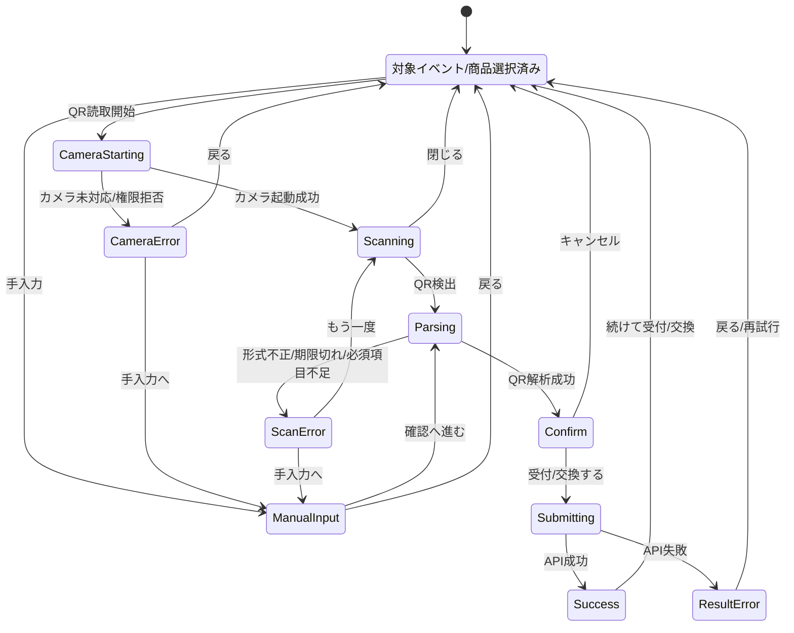

# QR機能 UI状態遷移仕様

このドキュメントは、LinkTwon のQR機能をUIとして作成・実装するための状態遷移を整理したものです。

QRは **利用者が提示し、イベント主催者または商店スタッフが読み取る** 方式を前提とします。イベント主催者・商店側がQRを発行して利用者が読む方式ではありません。

## 対象ロール

| ロール | 目的 | 主な画面 |
|---|---|---|
| 利用者 | 本人確認QRを提示する | QRコード表示画面 |
| イベント主催者 | 利用者QRを読み取り、イベント受付とポイント付与を確定する | `E-04` から `E-08` |
| 商店 | 利用者QRを読み取り、ポイントによる商品交換を確定する | `S-04` から `S-08` |

## QRペイロード前提

QR内容は次の形式を基本とします。

```text
linktown://user-present?v=1&user_id=...&name=...&iat=...&exp=...&nonce=...
```

| 項目 | 用途 |
|---|---|
| `v` | QR仕様バージョン |
| `user_id` | 利用者識別子 |
| `name` | 確認画面に表示する利用者名 |
| `iat` | 発行時刻 |
| `exp` | 有効期限 |
| `nonce` | 重複利用防止 |

QRにはJWT、パスワード、決済情報、管理者権限情報などの秘密情報を含めません。

## 利用者側: QR提示状態

| 状態ID | 状態名 | 表示内容 | 操作 | 次状態 |
|---|---|---|---|---|
| `U-QR-01` | QR生成中 | QR表示領域のローディング | なし | `U-QR-02` / `U-QR-E01` |
| `U-QR-02` | QR表示中 | 本人確認QR、残り時間、説明文 | QR更新、ホームへ戻る | `U-QR-03` / ホーム |
| `U-QR-03` | QR更新中 | 更新ボタンdisabled、ローディング | なし | `U-QR-02` / `U-QR-E01` |
| `U-QR-04` | QR期限切れ | 期限切れ表示、再発行案内 | QRを更新 | `U-QR-03` |
| `U-QR-E01` | QR生成失敗 | 「QRを生成できませんでした」 | 再試行 | `U-QR-01` |
| `U-QR-E02` | 未ログイン/セッション切れ | ログイン誘導 | ログインへ | ログイン画面 |

### 利用者側UI要件

- QRの残り時間を表示する。
- 期限切れ時は古いQRを表示し続けず、明確に無効状態へ切り替える。
- QR更新中は二重更新を防ぐため、更新ボタンを無効化する。
- 画面説明は「イベント主催者または商店スタッフに提示してください」とする。

## イベント主催者側: QR受付状態

| 状態ID | 状態名 | 画面 | 表示内容 | 操作 | 次状態 |
|---|---|---|---|---|---|
| `E-QR-01` | イベント選択済み | `E-04` | 対象イベント、付与ポイント、受付済数 | QR読み取り開始 | `E-QR-02` |
| `E-QR-02` | カメラ起動待ち | `E-04` + camera overlay | カメラ準備中 | キャンセル | `E-QR-01` / `E-QR-E01` |
| `E-QR-03` | 読み取り待機 | `E-04` | カメラ枠、スキャンライン、案内文 | QRをかざす、閉じる | `E-QR-04` / `E-QR-01` |
| `E-QR-04` | QR解析中 | `E-04` | 読み取り済み、確認中 | なし | `E-QR-05` / `E-QR-E02` |
| `E-QR-05` | 受付確認 | `E-06` | 利用者名、付与ポイント、イベント名 | 受付する、キャンセル | `E-QR-06` / `E-QR-01` |
| `E-QR-06` | 受付送信中 | `E-06` | ボタンdisabled、送信中表示 | なし | `E-QR-07` / `E-QR-E03` |
| `E-QR-07` | 受付完了 | `E-07` | 完了チェック、利用者名、付与ポイント | 続けて受付 | `E-QR-01` |
| `E-QR-08` | 手入力 | `E-05` | QR内容入力欄 | 確認へ進む、戻る | `E-QR-04` / `E-QR-01` |

## 商店側: QR交換状態

| 状態ID | 状態名 | 画面 | 表示内容 | 操作 | 次状態 |
|---|---|---|---|---|---|
| `S-QR-01` | 商品選択済み | `S-04` | 対象商品、必要ポイント、在庫 | QR読み取り開始 | `S-QR-02` |
| `S-QR-02` | カメラ起動待ち | `S-04` + camera overlay | カメラ準備中 | キャンセル | `S-QR-01` / `S-QR-E01` |
| `S-QR-03` | 読み取り待機 | `S-04` | カメラ枠、スキャンライン、案内文 | QRをかざす、閉じる | `S-QR-04` / `S-QR-01` |
| `S-QR-04` | QR解析中 | `S-04` | 読み取り済み、確認中 | なし | `S-QR-05` / `S-QR-E02` |
| `S-QR-05` | 交換確認 | `S-06` | 利用者名、消費ポイント、商品名 | 交換する、キャンセル | `S-QR-06` / `S-QR-01` |
| `S-QR-06` | 交換送信中 | `S-06` | ボタンdisabled、送信中表示 | なし | `S-QR-07` / `S-QR-E03` |
| `S-QR-07` | 交換完了 | `S-07` | 完了チェック、利用者名、商品名、消費ポイント | 続けて交換 | `S-QR-01` |
| `S-QR-08` | 手入力 | `S-05` | QR内容入力欄 | 確認へ進む、戻る | `S-QR-04` / `S-QR-01` |

## 共通エラー状態

| 状態ID | ケース | 表示文言例 | 主な復帰操作 | 備考 |
|---|---|---|---|---|
| `QR-E01` | カメラ未対応 | この端末ではカメラ読み取りを利用できません | 手入力へ | `E-05` / `S-05` へ誘導 |
| `QR-E02` | カメラ権限拒否 | カメラの使用が許可されていません | 手入力へ、再試行 | ブラウザ権限変更の案内を出す |
| `QR-E03` | QR形式不正 | QRが読み取れませんでした | もう一度読み取る、手入力へ | `linktown://user-present` 以外を拒否 |
| `QR-E04` | 必須項目不足 | QRの情報が不足しています | もう一度読み取る | `user_id` / `exp` / `nonce` など |
| `QR-E05` | QR期限切れ | QRの有効期限が切れています | 新しいQRを提示してもらう | 利用者側のQR更新が必要 |
| `QR-E06` | 重複利用 | このQRは既に使用されています | もう一度読み取る | 同一nonceの再利用拒否 |
| `QR-E07` | 対象外 | このイベント/商品では利用できません | 戻る | event_id/service_idとの不整合 |
| `QR-E08` | ポイント不足 | ポイントが足りません | 商品一覧へ戻る | 商店側のみ |
| `QR-E09` | 在庫不足 | 在庫がありません | 商品一覧へ戻る | 商店側のみ |
| `QR-E10` | API通信失敗 | 接続できませんでした | 再試行 | network/offline/5xx |
| `QR-E11` | 認証切れ | セッションが切れました | 再ログイン | 読み取り側アプリの認証 |

## API結果とUI遷移

| API | 成功 | 失敗 |
|---|---|---|
| `POST /api/event/check-ins` | `E-QR-07` 受付完了 | `E-QR-E03` 受付失敗 |
| `POST /api/store/exchanges` | `S-QR-07` 交換完了 | `S-QR-E03` 交換失敗 |

### イベント受付APIの主な失敗表示

| HTTP相当 | 表示 |
|---|---|
| `400` | QR形式不正、必須項目不足、期限切れ |
| `401` | 読み取り側のセッション切れ |
| `403` | この担当者には受付権限がない |
| `404` | 対象イベントまたは利用者が見つからない |
| `409` | 重複受付、同一QRの再利用 |
| `5xx/network` | 接続できませんでした |

### 商品交換APIの主な失敗表示

| HTTP相当 | 表示 |
|---|---|
| `400` | QR形式不正、必須項目不足、期限切れ |
| `401` | 読み取り側のセッション切れ |
| `403` | この店舗には交換権限がない |
| `404` | 対象商品または利用者が見つからない |
| `409` | 重複交換、ポイント不足、在庫不足 |
| `5xx/network` | 接続できませんでした |

## Mermaid状態遷移図



## Figma作成時の必要画面

### 最低限必要な画面

| ID | 画面 |
|---|---|
| `E-04` / `S-04` | QR読み取り待機 |
| `E-05` / `S-05` | 手入力フォールバック |
| `E-06` / `S-06` | 確認モーダル |
| `E-07` / `S-07` | 成功 |
| `E-08` / `S-08` | 代表エラー |

### 状態差分として必要な表現

| 差分 | 表現 |
|---|---|
| カメラ起動中 | カメラ枠にローディング |
| 読み取り中 | スキャンライン、案内文 |
| 解析中 | 「確認しています」表示、操作不可 |
| 送信中 | 確認ボタンdisabled、二重送信防止 |
| カメラ不可 | 手入力誘導 |
| API失敗 | エラー画面またはエラーモーダル |

## 実装時の注意

- QR読み取り成功直後にAPIを確定送信しない。必ず確認画面を挟む。
- API送信中は受付/交換ボタンをdisabledにする。
- 成功後は読み取り画面へ戻り、連続処理できるようにする。
- QRの期限切れ、重複利用、ポイント不足は同じエラー画面パターンで文言だけ差し替える。
- カメラ権限拒否とカメラ未対応は失敗扱いではなく、手入力への代替導線として扱う。
- 利用者提示QRは短寿命にし、期限切れ時は利用者側で再発行してもらう。
