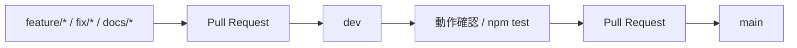

# ブランチ運用ルール

このリポジトリでは、システム本体の変更を `main` に直接入れず、`dev` を検証用ブランチとして挟む運用にします。

## ブランチの役割

| ブランチ | 役割 | 直接変更 |
| --- | --- | --- |
| `main` | 安定版。動作確認済みの内容だけを反映する | 原則禁止 |
| `dev` | 開発統合ブランチ。通常の変更はここへ入れる | 許可 |
| `feature/*` | 大きめの機能追加やリスクのある変更用 | 許可 |
| `fix/*` | 不具合修正用 | 許可 |
| `docs/*` | ドキュメントや資料更新用 | 許可 |

## 基本フロー



## 通常開発

1. `dev` を最新化する。
2. 小さな変更なら `dev` で作業する。
3. 影響範囲が大きい変更は `feature/*`、`fix/*`、`docs/*` を作る。
4. `npm test` が通ることを確認する。
5. PR の向きは原則 `feature/* -> dev` または `fix/* -> dev` にする。
6. `dev` で問題がなければ `dev -> main` の PR を作る。

## main へ反映してよい条件

- `npm test` が成功している。
- ブラウザで主要画面の確認が完了している。
- DB変更がある場合、初期化/マイグレーション/seed の影響を確認している。
- UI変更がある場合、PC幅とスマホ幅で表示崩れがない。
- 管理者機能や認証機能を変更した場合、権限チェックを確認している。
- PR の変更内容が説明され、レビューできる状態になっている。

## main へ直接入れてよい例外

原則としてありません。緊急修正が必要な場合も `hotfix/*` を作り、確認後に `main` と `dev` の両方へ反映します。

## jj を使う場合の例

`dev` で作業する場合:

```powershell
jj git fetch
jj bookmark track dev --remote=origin
jj new dev
# 変更作業
jj commit -m "変更内容"
jj bookmark set dev -r @-
jj git push --bookmark dev
```

大きめの変更を別ブックマークで作る場合:

```powershell
jj new dev
# 変更作業
jj commit -m "変更内容"
jj bookmark create feature/example -r @-
jj git push --bookmark feature/example
```

## git を使う場合の例

```powershell
git fetch origin
git switch dev
git pull --ff-only
# 変更作業
npm test
git add .
git commit -m "変更内容"
git push origin dev
```

## 推奨するGitHub設定

GitHub の Branch protection rules で以下を設定します。

### `main`

- Require a pull request before merging
- Require status checks to pass before merging
- Require branches to be up to date before merging
- Restrict who can push to matching branches
- Do not allow force pushes
- Do not allow deletions

### `dev`

- Require status checks to pass before merging
- Do not allow force pushes
- Do not allow deletions
- 必要に応じて Pull Request 必須にする

この設定はGitHub側の管理画面で行う必要があります。リポジトリ内のファイルだけでは完全には強制できません。
