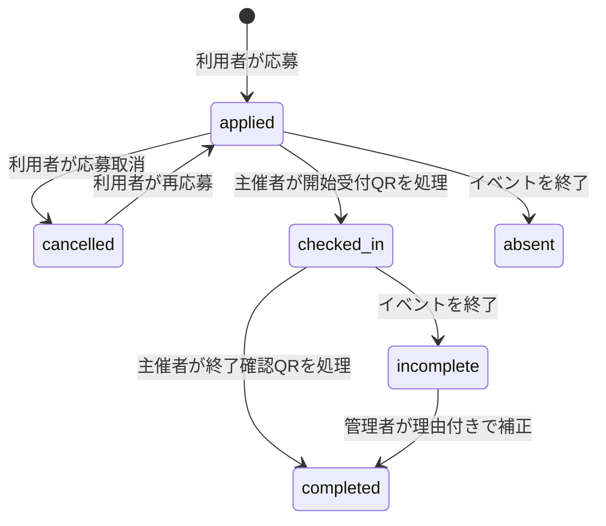

# イベント申請と参加完了処理の修正仕様

## 目的

本仕様は、イベント主催者から管理者へのイベント申請機能と、利用者の応募から参加完了までの処理を定義する。

イベントへの応募、開始受付、参加完了を別の状態として管理し、ポイントは終了確認QRの処理が成功した時点で一度だけ付与する。

## 対象範囲

修正対象は次のアプリケーションとサーバー処理である。

- 利用者向けWebアプリ
- イベント主催者向けアプリ
- 管理者向けアプリ
- バックエンドAPI
- MySQLとSQLiteのスキーマおよび移行処理
- イベント参加とポイント付与に関するテスト

## 現行実装の問題

### 応募時にポイントが付与される

利用者向けAPIの `completeParticipation` は、参加レコードの作成、利用者残高の加算、ポイント取引の作成を一つの処理として実行している。

`POST /events/participate` もこの処理を呼ぶため、利用者がイベントへ応募した時点でポイントが付与される。

対象箇所は `backend/controllers/eventController.js` の `completeParticipation` と `participateInEvent` である。

### 応募済み利用者を主催者アプリで受付できない

イベント主催者向けアプリのQR受付も `participations` を新規作成してポイントを付与する。

利用者が先に応募している場合は同じイベントの参加レコードが存在するため、主催者のQR受付は参加済みエラーになる。

対象箇所は `partner-portals/lib/partnerRepository.js` の `recordSqliteEventCheckIn` と `recordMysqlEventCheckIn` である。

### 応募と参加完了を画面上で区別できない

利用者向けWebアプリは、利用者履歴の `participations` を「応募済みイベント」として表示している。

同じデータを応募判定、参加済み一覧、予定イベント、ポイント履歴に使用しているため、応募と参加完了を別々に表示できない。

対象箇所は `frontend/src/App.tsx` の `loadApplicationData`、`handleApplyToEvent`、`EventsScreen` である。

### 主催者から管理者への申請経路がない

管理者向けアプリは、管理者がイベントを直接作成する機能だけを持つ。

主催者がイベント内容を申請し、管理者が承認または却下するためのデータ、API、画面は存在しない。

### イベントの担当主催者が正しく限定されない

管理者がイベントを作成すると、`assignEventToExistingOrganizers` がイベントをすべての主催者へ割り当てる。

申請した主催者だけが該当イベントを操作できるように、この自動割り当てを廃止する必要がある。

## イベント申請の仕様

主催者が提出する情報は、公開イベントへ直接保存せず、**イベント申請**として保存する。

イベント申請は次の状態を持つ。

| 状態 | 意味 | 主催者操作 | 管理者操作 |
| --- | --- | --- | --- |
| `pending` | 審査待ち | 編集、取り下げ | 承認、却下 |
| `approved` | 承認済み | 閲覧 | 公開イベントを管理 |
| `rejected` | 却下済み | 内容を修正して再申請 | 閲覧 |
| `withdrawn` | 主催者が取り下げ済み | 閲覧 | 閲覧 |

### 主催者向けアプリ

主催者向けアプリに「担当イベント」と「イベント申請」の画面を設ける。

申請フォームでは、イベント名、開始日時、終了日時、集合場所、概要、活動内容、注意事項、希望付与ポイントを入力する。

主催者は自分が作成した申請だけを閲覧し、`pending` の申請を編集または取り下げられる。

`rejected` の申請には管理者の却下理由を表示し、内容を修正した再申請を可能にする。

### 管理者向けアプリ

イベント管理画面に「公開イベント」と「承認待ち申請」の表示切り替えを設ける。

承認待ち件数を表示し、申請詳細から承認または却下できるようにする。

管理者は承認時にイベント内容と付与ポイントを確定できる。

却下時は主催者へ表示する理由の入力を必須とする。

### 承認処理

承認処理は次の更新を一つのDBトランザクションで実行する。

1. 対象申請を排他ロックし、状態が `pending` であることを確認する。
2. 確定した内容で `events` に公開イベントを作成する。
3. `event_organizer_events` に申請主催者と公開イベントの関係を作成する。
4. 申請を `approved` に更新し、公開イベントID、承認管理者、承認日時を保存する。
5. 公開イベントの翻訳キャッシュを生成する。

同じ申請への承認要求が重複した場合は、二つ目のイベントを作成せず `409 Conflict` を返す。

## 利用者参加の状態遷移

利用者のイベント参加は、**応募状態**、**開始受付状態**、**参加完了状態**を一つのライフサイクルとして管理する。

| 状態 | 意味 | ポイント | 利用者による取消 |
| --- | --- | --- | --- |
| `applied` | 応募済みで開始受付前 | 付与しない | 開始受付前に限り可能 |
| `checked_in` | 開始受付済みで終了確認前 | 付与しない | 不可 |
| `completed` | 終了確認済み | 状態遷移時に一度だけ付与 | 不可 |
| `cancelled` | 応募取消済み | 付与しない | 終了状態 |
| `absent` | 応募したが開始受付なし | 付与しない | 終了状態 |
| `incomplete` | 開始受付後に終了確認なし | 付与しない | 終了状態 |

`cancelled` の利用者は、イベントが受付中かつ開始前であれば同じ参加レコードを `applied` に戻して再応募できる。

状態変更の履歴は、現在状態を保持する `participations` とは別の監査テーブルへ記録する。

## QR処理

利用者は開始受付時と終了確認時に、その時点で有効な本人確認QRを主催者へ提示する。

主催者が発行したQRを利用者が読む方式は採用しない。

### 開始受付QR

開始受付QRは `applied` から `checked_in` への遷移だけを行う。

開始受付では利用者残高とポイント取引を変更しない。

未応募、取消済み、参加完了済みの利用者は開始受付できない。

### 終了確認QR

終了確認QRは `checked_in` から `completed` への遷移を行う。

終了確認では、参加状態の更新、利用者残高の加算、ポイント取引の作成、スキャン履歴の作成を一つのDBトランザクションで実行する。

サーバー時刻が `event_end_datetime` より前の場合は終了確認を拒否する。

イベントが予定より早く終了した場合は、管理者が終了日時を修正してから終了確認を開始する。

開始受付が完了していない利用者にはポイントを付与しない。

同じ利用者とイベントに対する終了確認は一度だけ成功し、重複要求では残高を変更せず `409 Conflict` を返す。

開始受付と終了確認では別々の短寿命QRを使用する。

同一nonceの再利用は、イベント参加に関するイベントと処理種別にかかわらず拒否する。

### 管理者による補正

QR故障などで終了確認できなかった `incomplete` の参加に限り、管理者が理由を入力して参加完了へ補正できる。

補正処理も通常の終了確認と同じポイント付与トランザクションを使用し、操作管理者と理由を監査履歴へ保存する。

主催者がQRを経由せず任意にポイントを付与する機能は設けない。

## データベースの修正

### `event_submissions`

主催者のイベント申請を保存する。

主な列は `submission_id`、`organizer_id`、イベント入力項目、`requested_grant_points`、`status`、`review_note`、`reviewed_by`、`reviewed_at`、`approved_event_id`、作成日時、更新日時とする。

### `events`

イベント終了時刻を保持する `event_end_datetime` を追加する。

イベント状態は `active`、`paused`、`completed`、`cancelled` を扱えるようにする。

新規申請では終了日時を必須とし、終了日時が開始日時より後であることを検証する。

### `participations`

既存テーブルを参加ライフサイクルの保存先として継続利用する。

`status`、`grant_points_snapshot`、`applied_at`、`checked_in_at`、`completed_at`、`cancelled_at`、`completion_method`、`completion_note`、`completed_by_admin_id` を追加する。

`grant_points_snapshot` は応募時点の予定付与ポイントを保存し、応募後のイベント編集による付与額の変動を防ぐ。

`granted_points` は実際に付与したポイントを表し、`completed` になるまでは `0` とする。

`completion_method` は `qr`、`admin`、`legacy` のいずれかとし、通常の終了確認、管理者補正、既存データ移行を区別する。

### `event_participation_status_history`

応募から参加完了までの状態変更を監査できるように、変更前状態、変更後状態、変更理由、実行主体、変更日時を保存する。

取消後の再応募では新しい参加レコードを作成せず、状態履歴を追加したうえで既存レコードを `applied` に戻す。

### `event_attendance_scans`

開始受付と終了確認の監査履歴を保存する。

主な列は `scan_id`、`participation_id`、`organizer_id`、`scan_type`、`nonce`、QR発行日時、QR有効期限、処理日時とする。

`scan_type` は `check_in` または `completion` とする。

`participation_id` と `scan_type` の組み合わせ、および `nonce` に一意制約を設定する。

### `point_transactions`

イベント参加による付与元を示す `participation_id` を追加する。

一つの参加に対してポイント付与取引が一つだけ作成される一意制約を設定する。

## APIの修正

### 主催者向けAPI

| Method | Endpoint | 処理 |
| --- | --- | --- |
| `GET` | `/api/event/submissions` | 自分の申請一覧を取得 |
| `POST` | `/api/event/submissions` | イベントを申請 |
| `PUT` | `/api/event/submissions/:id` | 審査待ち申請を編集 |
| `POST` | `/api/event/submissions/:id/withdraw` | 審査待ち申請を取り下げ |
| `POST` | `/api/event/check-ins` | 開始受付を確定 |
| `POST` | `/api/event/completions` | 終了確認とポイント付与を確定 |
| `POST` | `/api/event/events/:id/close` | イベント受付を終了 |

### 管理者向けAPI

| Method | Endpoint | 処理 |
| --- | --- | --- |
| `GET` | `/admin/event-submissions` | イベント申請一覧を取得 |
| `GET` | `/admin/event-submissions/:id` | イベント申請詳細を取得 |
| `POST` | `/admin/event-submissions/:id/approve` | 申請を承認して公開イベントを作成 |
| `POST` | `/admin/event-submissions/:id/reject` | 理由を保存して申請を却下 |
| `POST` | `/admin/participations/:id/complete` | 理由付きで参加完了を補正 |
| `POST` | `/admin/events/:id/close` | 管理者権限でイベント受付を終了 |

### 利用者向けAPI

`POST /events/participate` は応募登録だけを行い、レスポンスから `granted_points` と加算後残高を除外する。

`DELETE /events/:id/participation` は `applied` の参加だけを `cancelled` に更新し、ポイント取消取引を作成しない。

`GET /events` はログイン利用者の `participation_status` を返す。

`GET /users/:id/history` は参加状態を返し、ポイント履歴には `completed` の付与だけを含める。

利用者がチェックインコードを入力する `POST /events/check-in` と、管理画面のチェックインコード発行機能は廃止対象とする。

## 画面の修正

### 利用者向けWebアプリ

イベント画面のタブを「おすすめ」「いいね」「応募済み」「参加済み」の四つにする。

「応募済み」には `applied` と `checked_in` を表示する。

`checked_in` には「受付済み、終了確認待ち」と表示する。

「参加済み」には `completed` だけを表示し、付与ポイントと参加完了日時を表示する。

応募取消ボタンは `applied` にだけ表示する。

ホーム画面の参加予定イベントには `applied` と `checked_in` だけを使用し、`completed` は表示しない。

### イベント主催者向けアプリ

イベントごとに申込数、開始受付済み数、参加完了数を表示する。

QR操作を「開始受付QR」と「終了確認QR」に分ける。

終了予定時刻までは終了確認QRの操作を無効にする。

確認画面では、処理種別、利用者名、イベント名、終了確認時の付与ポイントを表示する。

開始受付の成功画面ではポイントを付与したように表示しない。

終了確認の成功画面だけに付与ポイントと処理後残高を表示する。

主催者が担当イベントを終了できる「イベント受付終了」を設ける。

イベント受付終了の確認画面には、申込数、開始受付済み数、参加完了数、未完了数を表示する。

### 管理者向けアプリ

イベント申請一覧、申請詳細、承認、却下理由入力を追加する。

イベント詳細に申込数、開始受付済み数、参加完了数、未完了数を表示する。

参加完了の補正画面では、対象利用者、イベント、付与ポイント、補正理由を確認してから確定する。

## イベント終了処理

イベントを `completed` に変更すると、未確定の参加状態を次のように確定する。

- `applied` は `absent` に更新する。
- `checked_in` は `incomplete` に更新する。
- `completed` は変更しない。

イベント終了後は通常の開始受付と終了確認を受け付けない。

イベントを担当する主催者または管理者だけがイベント受付を終了できる。

イベント受付終了は取り消せず、再開が必要な場合は管理者が監査理由を残して状態を変更する。

終了後の参加完了は管理者による理由付き補正だけを許可する。

参加レコードが存在するイベントは物理削除せず、`cancelled` または `completed` へ更新して監査情報を残す。

## 既存データの移行

既存の `participations` は、すでにポイント付与済みであるため `completed` として移行する。

既存利用者のポイント残高を減算せず、過去の付与を取り消さない。

既存の `granted_points` を `grant_points_snapshot` に複写し、既存の `participated_at` を `applied_at` と `completed_at` に設定する。

既存の `portal_event_check_ins` は、開始受付と終了確認を区別できないため既存テーブルに履歴として保持する。

既存レコードを `event_attendance_scans` へ複写せず、移行後に発生したQR処理だけを新しい監査テーブルへ保存する。

既存参加の `completion_method` は `legacy` に設定する。

既存イベントの終了日時は推測できないため、移行時はNULLを許可し、管理画面から補完する。

新規イベント申請と新規管理者作成イベントでは終了日時を必須とする。

MySQLとSQLiteで同じ状態、制約、移行結果になるように両方のスキーマを更新する。

## 受け入れ条件

1. 主催者が申請したイベントは、管理者が承認するまで利用者向けイベント一覧へ表示されない。
2. 管理者が承認すると、公開イベントが一つだけ作成され、申請主催者の担当イベントへ表示される。
3. イベントは申請主催者以外の主催者アプリへ表示されない。
4. 利用者が応募してもポイント残高とポイント取引は変化しない。
5. 主催者が開始受付QRを処理してもポイント残高は変化しない。
6. 主催者が終了確認QRを処理すると、予定ポイントが一度だけ付与される。
7. 終了確認QRを重複処理しても、ポイント残高とポイント取引は増えない。
8. 未応募または開始受付前の利用者に終了確認を実行できない。
9. `applied` の応募は取消でき、`checked_in` と `completed` は取消できない。
10. 利用者向けイベント画面で応募済みと参加済みを別のタブとして確認できる。
11. ポイント履歴には参加完了時の付与だけが表示される。
12. 管理者補正は理由と操作管理者が監査履歴に残る。
13. 日本語と英語の固定文言がすべて切り替わり、承認されたイベントの可変文言は翻訳キャッシュを参照する。
14. 終了予定時刻より前の終了確認ではポイントが付与されない。
15. イベント受付終了後は開始受付と終了確認を実行できない。
16. 応募取消後の再応募が一つの参加レコードと複数の状態履歴として保存される。

## テストの修正

バックエンドのスモークテストから、応募または開始受付直後にポイントが増えるという期待値を削除する。

応募、開始受付、終了確認、重複終了確認、応募取消、未応募エラー、状態不正エラーを独立したテストにする。

主催者向けテストでは、開始受付レスポンスにポイント付与結果が含まれず、終了確認レスポンスにだけ付与結果が含まれることを確認する。

管理者向けテストでは、申請承認の冪等性、却下理由、申請主催者だけへの割り当て、承認時翻訳キャッシュを確認する。

利用者向けテストでは、応募済みタブと参加済みタブの振り分け、状態別ボタン、ポイント履歴への反映を確認する。

## 実装順序

1. 後方互換性を保ったDBマイグレーションを追加する。
2. 利用者の応募APIからポイント付与を分離する。
3. 主催者向けの開始受付APIと終了確認APIを実装する。
4. 主催者のイベント申請APIと管理者の審査APIを実装する。
5. 利用者向けWebアプリの状態表示とタブを修正する。
6. 主催者向けアプリに申請画面と二種類のQR操作を追加する。
7. 管理者向けアプリに申請審査と参加補正を追加する。
8. MySQLとSQLiteのテストを更新し、全体の回帰テストを実行する。
